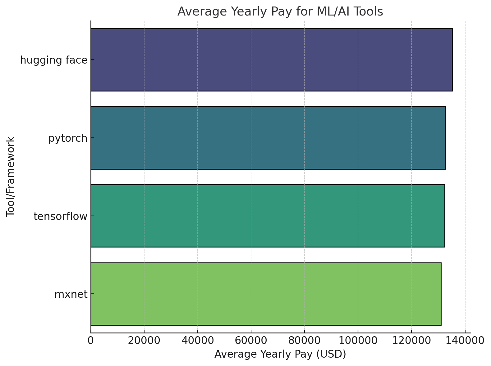

# Introduction

I will be diving into the job market, specifically focusing on Machine Learning and Data Analysis Roles. This project explores the top-paying jobs, most in-demand skills, and where high demand meets high salary in these roles. The dataset contains job postings from the Data and Machine Learning Domain specifically for the year 2023.  

A huge Thanks to Luke Barouse for the dataset and SQL Data Analytics Course!  
Check his channel out here - https://www.youtube.com/@LukeBarousse  

Check out the queries here - 
1) [Top Paying Jobs](/1_top_paying_jobs.sql)
2) [Skills required for Top Paying Jobs](/2_top_paying_job_skills.sql)
3) [In Demand Skill](/3_in_demand_skills.sql)
4) [Top Skills based on Salary](/4_top_skills_based_on_salary.sql)
5) [Most Optimal Skills to Learn](/5_optimal_skills.sql)  

# Background

# Tools Used

# Analysis

# What I Learned

# Conclusions

#  Questions to Answer
1) What are the top-paying jobs for my roles - ML, Data Analytics?
2) What are the skills required for these top paying roles?
3) What are the most in-demand skills for my roles?
4) What are the top skills based on salary?
5) What are the most optimal skills to learn?
> 5. Optimal: High Demand and High Paying

#   1) What are the top-paying jobs for ML and Data Analytics Roles?

Roles such as Data Analyst, Director of Data Analytics, and Research Scientist dominate this list, indicating a high demand for analytics and leadership roles in data-driven industries
>Senior and Leadership positions dominate the highest salary range ($300,000 and above), particularly those with "Director" or "Head" titles 

The US overwhelmingly leads, offering more than 80% of the highest paying positions, highlighting its dominance in tech and analytic roles
>Other countries include India, Germany, France, Taiwan, etc, though with fewer entries and generally lower salaries. 

Many prominent companies also make this list -
> Google, Meta, OpenAI, TikTok 

 

#  2) What are the skills required for these top paying roles?

Python and SQL seem to be the most common skills required, which makes sense since they are essential for data manipulation, analysis and querying.
> R - a statistical computing language also ranks high up on this list 

Tableau, Excel, and PowerBi take the next positions as they are widely used for creating dashboards and communicating insights effectively.  
 They are followed by Big Data Tools like Spark, Snowflake, and Oracle which indicate a need of handling and querying large datasets 

#  3) What are the most in-demand skills for my roles?

| Skills | Count |
|:---------|:-------:|
|sql | 96125 |
| excel | 67616 |
| python | 67011 |
| tableau | 46959 |
| power bi | 39725 | 
| r | 31646 |
| sas | 28432 |
| powerpoint | 13951 |
| word | 13864 |
| azure | 13674 |

#  4) What are the top skills based on salary?
 
* SVN stands out with an average pay of $400,000, which is significantly higher than other skills. This might be due to specialized roles or niche demand.
* Other high paying skills include Haskell($213,000), Kotlin($184,500), and Solidity($179,000)
* These skills are often associated with modern software development, blockchain, and functional programming.
* Skills like HuggingFace(#135,190), PyTorch($132,689), and Tensorflow($132,357) are valued highly, reflecting their importance in Machine Learning and AI.

 