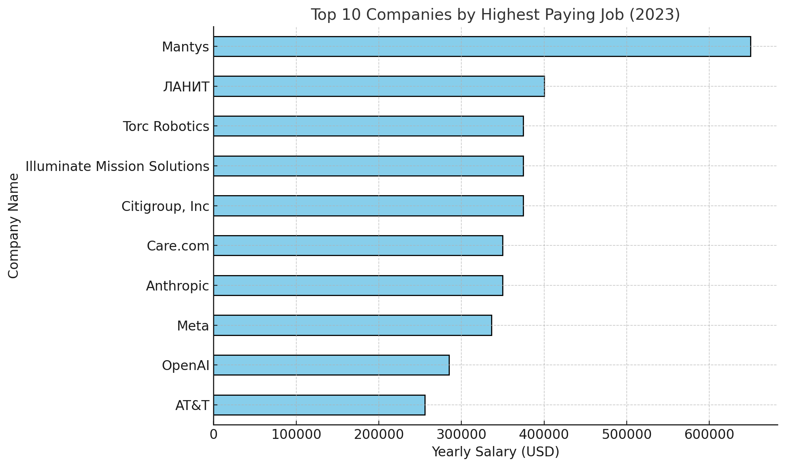

TO Do: Update Readme later

# Questions to Answer  \
1) What are the top-paying jobs for my roles - ML, Data Analytics?
2) What are the skills required for these top paying roles?
3) What are the most in-demand skills for my roles?
4) What are the top skills based on salary?
5) What are the most optimal skills to learn?
> 5. Optimal: High Demand and High Paying  \

# 1) What are the top-paying jobs for ML and Data Analytics Roles?

* Roles such as Data Analyst, Director of Data Analytics, and Research Scientist dominate this list, indicating a high demand for analytics and leadership roles in data-driven industries
>* Senior and Leadership positions dominate the highest salary range ($300,000 and above), particularly those with "Director" or "Head" titles

* The US overwhelmingly leads, offering more than 80% of the highest paying positions, highlighting its dominance in tech and analytic roles
>* Other countries include India, Germany, France, Taiwan, etc, though with fewer entries and generally lower salaries.

* Many prominent companies also make this list -
> * Google, Meta, OpenAI, TikTok

# 2) What are the skills required for these top paying roles?

* Python and SQL seem to be the most common skills required, which makes sense since they are essential for data manipulation, analysis and querying.
* R - a statistical computing language also ranks high up on this list
* Tableau, Excel, and PowerBi take the next positions as they are widely used for creating dashboards and communicating insights effectively.
* They are followed by Big Data Tools like Spark, Snowflake, and Oracle which indicate a need of handling and querying large datasets

# 3) What are the most in-demand skills for my roles?

| Skills | Count |
|:---------|:-------:|
|sql | 96125 |
| excel | 67616 |
| python | 67011 |
| tableau | 46959 |
| power bi | 39725 | 
| r | 31646 |
| sas | 28432 |
| powerpoint | 13951 |
| word | 13864 |
| azure | 13674 |

# 4) What are the top skills based on salary?
